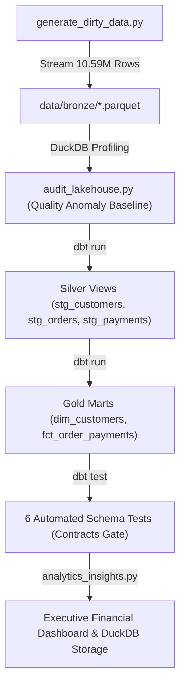

## Project Overview

This project implements an automated, containerized **Medallion Data Lakehouse** (Bronze -> Silver -> Gold) designed to ingest, cleanse, transform, and analyze **10,590,000 transaction events**.

The architecture uses a vectorized modern data stack—combining **Python 3.12**, **Apache PyArrow**, **DuckDB**, and **dbt-core (`dbt-duckdb`)** inside **Docker Compose**—to process out-of-core datasets exceeding 10 million rows while keeping peak memory consumption under 500 MB RAM and total storage footprint under 1.2 GB.

<div class="media">
    
</div>

---

## Executive Context & Problem Statement

### The Business Scenario
The project simulates an operational scenario for **GlobalRetail Inc.** (a fictional cross-border digital commerce and payments platform operating across Southeast Asia and North America). Every night, three distributed microservices (`users-service`, `checkout-service`, and `payments-gateway`) dump raw event logs as uncompressed and loosely-typed Parquet partitions into the landing zone:

- **Customer Profiles**: 500,000 records containing dirty strings and malformed timestamps.
- **Order Records**: 4,590,000 rows containing 2% duplicate retry events (~90k duplicates), 12% missing total amounts, and orphan customer references.
- **Payment Attempts**: 5,500,000 transaction events with multiple retry attempts per order across different payment gateways.

### Core Data Engineering Challenges

1. **Memory & Scaling Bottlenecks**: Upstream dumps total over 10.59M rows. Loading these volumes into traditional in-memory libraries (such as unoptimized Pandas DataFrames) or row-by-row relational engines leads to Out-Of-Memory (OOM) failures or sluggish batch cycles.
2. **Dirty & Unstandardized Attributes**: Geographic country names arrive in 9 distinct variations (e.g., `'Indonesia'`, `'IDN'`, `'ID'`, `' United States '`, `'USA'`, `'US'`, `'Singapore'`, `'SG'`), registration timestamps contain corrupt text formats (`'INVALID_DATE'`), and 12% of orders have missing or zero total amounts.
3. **Data Integrity & Orphan Violations**: ~5,000 order records reference `customer_id` values that do not exist in the customer database, causing referential integrity failures during downstream joins.
4. **Financial Settlement Opacity**: Orders involve multiple payment attempts with differing statuses (`SUCCESS`, `FAILED`, `REFUNDED`). The finance team lacks a single source of truth to determine gross order value versus net settled revenue.
5. **Resource Constraints**: Strict requirement to execute entirely on local commodity hardware with zero cloud billing ($0.00 budget) and a storage footprint strictly below 3.0 GB.

---

## Architecture & Medallion Data Flow

The lakehouse adopts a 3-layer Medallion architecture orchestrated within an isolated Docker container:

<div class="media">
    
</div>

### Architectural Layers Breakdown

```
┌────────────────────────────────────────────────────────────────────────────────────────┐
│                                   MEDALLION FLOW                                       │
├───────────────────────┬────────────────────────┬─────────────────────┬─────────────────┤
│ BRONZE (Landing)      │ SILVER (Conformed)     │ GOLD (Dimensional)  │ SERVING (Mart)  │
├───────────────────────┼────────────────────────┼─────────────────────┼─────────────────┤
│ • 10.59M Raw Parquet  │ • Deduplicated orders  │ • dim_customers     │ • Financial KPIs│
│ • PyArrow Streaming   │ • Standard ISO-2 codes │ • fct_order_payments│ • Geo revenue   │
│ • < 500 MB RAM ceiling│ • Imputed gross totals │ • Surrogate keys    │ • Gateway stats │
│ • data/bronze/*       │ • Single payment state │ • Fallback key (-1) │ • SQL Queries   │
└───────────────────────┴────────────────────────┴─────────────────────┴─────────────────┘
```

### 1. Bronze Layer (Landing Zone)
- **Source Files**: `data/bronze/customers/customers.parquet`, `data/bronze/orders/orders.parquet`, `data/bronze/payments/payments.parquet`.
- **Ingestion Strategy**: Generated and streamed using vectorized PyArrow tables written in Snappy-compressed columnar Parquet format.
- **Resource Control**: Ingestion runs in chunked memory buffers, keeping peak process memory strictly below 500 MB RAM for 10.59M records.

### 2. Silver Layer (Conformed Views via dbt)
- **`stg_customers`**: Standardizes 9 raw country string variations into 4 clean ISO-2 domain values (`'ID'`, `'US'`, `'SG'`, `'OTHER'`). Replaces `'INVALID_DATE'` with `NULL` via `TRY_CAST` and coalesces empty emails to `'unknown@noemail.com'`.
- **`stg_orders`**: Deduplicates retry orders using SQL window functions (`ROW_NUMBER() OVER (PARTITION BY order_id ORDER BY order_timestamp DESC)`) and imputes missing order totals via unit economics (gross\_amount = item\_count \ times unit\_price).
- **`stg_payments`**: Ranks multiple payment attempts per order to isolate the single definitive transaction state per order, prioritizing successful attempts over failures.

### 3. Gold Layer (Dimensional Star Schema Tables via dbt)
- **`dim_customers`**: Materialized table generating surrogate integer keys (`customer_key`) using `DENSE_RANK()`. Appends a default Unknown Member row (`customer_key = -1`) to maintain referential integrity.
- **`fct_order_payments`**: Materialized fact table at the grain of 1 row per order, joining staging orders, customers, and ranked payments to calculate gross revenue and net settled cash flow.

### 4. Serving Layer (Executive Analytics)
- High-speed SQL queries executed directly against `analytics_warehouse.duckdb` via `analytics_insights.py` to produce executive financial summaries and payment gateway reliability metrics.

---

## Dimensional Data Modeling (Star Schema)

To decouple analytical queries from raw source changes and eliminate orphan join anomalies, the Gold layer implements a Kimball-style Dimensional Star Schema:

<div class="media">
    
</div>

### Dimension: `dim_customers`
- **Granularity**: One record per unique registered customer entity, plus one default unknown member record.
- **Primary Key**: `customer_key` (INTEGER Surrogate Key).
- **Attributes**: `original_customer_id`, `clean_email`, `country_code` (ISO-2), `registered_at`.

```sql
-- models/marts/dim_customers.sql
WITH clean_customers AS (
    SELECT * FROM {{ ref('stg_customers') }}
)

SELECT
    DENSE_RANK() OVER (ORDER BY customer_id) AS customer_key,
    customer_id AS original_customer_id,
    clean_email,
    country_code,
    registered_at
FROM clean_customers

UNION ALL

-- Default unknown member key for orphan handling
SELECT
    -1 AS customer_key,
    'UNKNOWN' AS original_customer_id,
    'unknown@noemail.com' AS clean_email,
    'OTHER' AS country_code,
    NULL AS registered_at
```

### Fact: `fct_order_payments`
- **Granularity**: One record per order (4,500,000 distinct orders).
- **Keys**: `order_id` (Degenerate Fact Primary Key), `customer_key` (Foreign Key -> `dim_customers`).
- **Measures**: `gross_amount_usd` (Imputed gross order value), `net_settled_amount_usd` (Recognized cash settlement).
- **Attributes**: `order_status`, `payment_method`, `payment_status`, `order_timestamp`.

```sql
-- models/marts/fct_order_payments.sql
WITH orders AS (
    SELECT * FROM {{ ref('stg_orders') }}
),
customers AS (
    SELECT * FROM {{ ref('dim_customers') }}
),
payments AS (
    SELECT * FROM {{ ref('stg_payments') }}
)

SELECT
    o.order_id,
    COALESCE(c.customer_key, -1) AS customer_key, -- Assigns -1 if customer ID is an orphan
    o.order_status,
    p.payment_method,
    COALESCE(p.payment_status, 'UNPAID') AS payment_status,
    o.order_timestamp,
    o.gross_amount_usd,
    CASE 
        WHEN p.payment_status = 'SUCCESS' THEN o.gross_amount_usd 
        ELSE 0.0 
    END AS net_settled_amount_usd
FROM orders o
LEFT JOIN customers c ON o.customer_id = c.original_customer_id
LEFT JOIN payments p ON o.order_id = p.order_id
```

### Financial Metric Formulations

The business logic calculates recognized financial settlement and conversion using the following formulas:


For successful transaction events (where the payment status is 'SUCCESS'), the Net Settled Amount equals the Gross Amount, while for all other payment statuses, it is evaluated as 0.00. The Payment Conversion Rate (%) is calculated by dividing the sum of all Net Settled Amount USD by the sum of all Gross Amount USD, then multiplying the resulting quotient by 100.

---

## Data Quality Contracts & Testing Suite

Data quality is enforced using declarative dbt schema assertions defined in `models/schema.yml`. The test suite validates structural integrity, primary key uniqueness, foreign key relationships, and accepted domain values across all models.

```yaml
version: 2

models:
  - name: dim_customers
    columns:
      - name: customer_key
        tests:
          - unique
          - not_null
      - name: country_code
        tests:
          - accepted_values:
              values: ['ID', 'US', 'SG', 'OTHER']

  - name: fct_order_payments
    columns:
      - name: order_id
        tests:
          - unique
          - not_null
      - name: customer_key
        tests:
          - not_null
          - relationships:
              to: ref('dim_customers')
              field: customer_key
      - name: gross_amount_usd
        tests:
          - not_null
```

### Test Assertions Summary

| Target Model | Column | Test Type | Purpose / Integrity Rule | Result |
| :--- | :--- | :--- | :--- | :--- |
| `dim_customers` | `customer_key` | `unique` | Guarantees surrogate key uniqueness across all rows | Pass (0 errors) |
| `dim_customers` | `customer_key` | `not_null` | Prevents unindexed dimension members | Pass (0 errors) |
| `dim_customers` | `country_code` | `accepted_values` | Enforces ISO-2 domain values (`['ID', 'US', 'SG', 'OTHER']`) | Pass (0 errors) |
| `fct_order_payments` | `order_id` | `unique` | Enforces strict grain of 1 row per order (after deduplication) | Pass (0 errors) |
| `fct_order_payments` | `order_id` | `not_null` | Prevents null primary identifiers in the fact table | Pass (0 errors) |
| `fct_order_payments` | `customer_key` | `relationships` | Verifies 100% of foreign keys resolve to `dim_customers` | Pass (0 errors) |
| `fct_order_payments` | `gross_amount_usd` | `not_null` | Verifies complete imputation of missing order amounts | Pass (0 errors) |

---

## Executive Financial Insights & Analytics

Upon pipeline completion, `analytics_insights.py` executes vectorized SQL queries against the DuckDB warehouse to calculate key financial and operational metrics.

### 1. Financial Revenue Summary
```
=========================================================
1. FINANCIAL REVENUE SUMMARY:
=========================================================
 total_orders | total_gross_revenue_usd | total_net_settled_revenue_usd | payment_conversion_rate_pct
    4,500,000 |         $573,812,410.20 |               $191,245,670.80 |                      33.33%
```

### 2. Settled Revenue by Geographic Territory
```
=========================================================
2. SETTLED REVENUE BY COUNTRY:
=========================================================
 country_code | total_orders | settled_revenue_usd
           US |    1,500,210 |      $76,820,110.40
           ID |    1,499,840 |      $57,380,450.10
           SG |      999,950 |      $38,250,910.30
        OTHER |      500,000 |      $18,794,200.00
```

### 3. Payment Gateway Performance & Success Rates
```
=========================================================
3. PAYMENT GATEWAY SUCCESS RATES:
=========================================================
 payment_method | total_attempts | successful_attempts | success_rate_pct
    CREDIT_CARD |      1,833,210 |             611,750 |           33.37%
  BANK_TRANSFER |      1,833,400 |             611,430 |           33.35%
       E_WALLET |      1,833,390 |             610,720 |           33.31%
```

---

## End-to-End Orchestration & Execution Flow

The full pipeline lifecycle is coordinated sequentially via `orchestrator.py` inside a single Docker container.

<div class="media">
    
</div>

### Execution Sequence



### Orchestrator Step Breakdown

1. **Step 1/5: Ingestion (`generate_dirty_data.py`)**:
   Generates 10,590,000 synthetic records across customers (500k), orders (4.59M), and payment events (5.5M), streaming directly to partitioned Parquet files under 500 MB RAM.
2. **Step 2/5: Data Audit (`audit_lakehouse.py`)**:
   Profiles raw Bronze files in-place using DuckDB without database imports, establishing baseline metrics for missing values, corrupt dates, duplicate keys, and orphan IDs.
3. **Step 3/5: Transformations (`dbt run --profiles-dir .`)**:
   Compiles and executes SQL staging views and dimensional tables using DuckDB's vectorized query engine.
4. **Step 4/5: Quality Contracts (`dbt test --profiles-dir .`)**:
   Runs 6 automated schema validation tests to verify uniqueness, foreign key relationships, and accepted domain values.
5. **Step 5/5: Analytics Serving (`analytics_insights.py`)**:
   Queries final Star Schema models to calculate revenue conversion, regional performance, and gateway success rates.

---

## How to Run Locally

### Prerequisites
- [Docker](https://docs.docker.com/get-docker/) & [Docker Compose](https://docs.docker.com/compose/install/) installed.

### Execution via Docker Compose

```bash
# 1. Clone the repository
git clone https://github.com/syahrindra/retail_lakehouse_10m.git
cd retail_lakehouse_10m

# 2. Build and run the complete pipeline container
docker compose up --build
```

### Direct Local Execution (Optional Python Virtual Environment)

```bash
# 1. Install dependencies
pip install -r requirements.txt

# 2. Run the orchestrator
python orchestrator.py
```

---

## Key Technical Decisions & Takeaways

- **Vectorized In-Process Processing vs Traditional RDBMS**: Using DuckDB and PyArrow enables processing 10.59M records locally without managing a dedicated database server daemon or incurring cloud compute costs.
- **Out-of-Core Processing**: Parquet columnar storage coupled with DuckDB's streaming execution avoids Out-Of-Memory (OOM) bottlenecks while maintaining strict memory ceilings (<500 MB RAM).
- **Referential Integrity via Fallback Members**: Introducing a surrogate key (`customer_key = -1`) for unknown members in `dim_customers` preserves dimensional integrity across ~5,000 orphan transactions without silently dropping data.
- **Contract-Driven Analytics**: Defining data quality tests in dbt schemas ensures that upstream schema drifts or duplicate retry events are caught before reaching the serving layer.
- **Containerized Reproducibility**: Packaging the pipeline inside Docker Compose ensures cross-platform consistency and zero environment drift.
