## Executive Summary & Business Context

In high-density urban logistics and e-commerce operations across **JABODETABEK** (Jakarta, Bogor, Depok, Tangerang, Tangerang Selatan, Bekasi), severe weather conditions—such as sudden high precipitation and heavy winds—frequently cause severe delivery delays, courier routing bottlenecks, and operational cost spikes.

### The Operational Challenge
- **Disparate JSON Data**: Raw weather API responses arrive as nested, unvalidated JSON payloads with varying timestamps and non-standardized units.
- **Query Bottlenecks**: Executing complex analytical transformations directly on unflattened raw JSON slows down BI dashboards and real-time decision engines.
- **Lack of Standardized Metrics**: Logistics planners lack daily aggregated risk flags (e.g., heavy rain alerts per region) to proactively adjust delivery SLAs.

### The Solution
This project establishes a high-performance **local ELT (Extract, Load, Transform) Data Warehouse** powered by **DuckDB** and **dbt (data build tool)**. The pipeline automatically ingests hourly weather data across all 6 JABODETABEK metropolitan cities, parses and normalizes JSON payloads inside DuckDB's vectorized analytical engine, enforces data quality tests, and generates production-ready analytical fact tables.

---

##  Data Architecture & Pipeline Design

The architecture follows the **ELT (Extract, Load, Transform)** paradigm, decoupling ingestion from transformation for maximum flexibility and performance.

```mermaid
flowchart LR
    subgraph External ["Data Source"]
        API["Open-Meteo REST API\n(Hourly Weather Streams)"]
    end

    subgraph ExtractLoad ["Extract & Load (Python)"]
        EL["requests + DuckDB\nDirect JSON Ingestion"]
    end

    subgraph Warehouse ["DuckDB OLAP Warehouse"]
        subgraph Raw ["1. Raw Layer"]
            L1["raw_weather_payloads\n(JSON Payloads)"]
        end
        subgraph Staging ["2. Staging Layer (dbt)"]
            L2["stg_weather_events\n(Parsed & Casted View)"]
        end
        subgraph Marts ["3. Analytics Mart (dbt)"]
            L3["fct_daily_city_metrics\n(Fact Table & Risk Flags)"]
        end
    end

    subgraph Testing [" Data Quality"]
        TEST["dbt test assertions\n(not_null, integrity)"]
    end

    API -->|HTTP GET| EL
    EL -->|INSERT INTO| L1
    L1 -->|dbt compile/run| L2
    L2 -->|dbt aggregate| L3
    L3 -->|Validate| TEST
```



### Architectural Layers

1. **Raw Ingestion Layer (`raw_weather_payloads`)**:
   - Stores raw API responses directly as native DuckDB JSON blobs alongside metadata (`city_name`, UTC `ingested_at`).
   - Ensures lossless, audit-ready storage before applying any transformations.

2. **Staging Layer (`stg_weather_events`)**:
   - Implemented as a dbt view (`models/staging/stg_weather_events.sql`).
   - Parses nested JSON structures using DuckDB's `from_json()` and `unnest()`.
   - Explicitly casts columns to proper types (`TIMESTAMP`, `FLOAT`, `VARCHAR`).

3. **Analytics Mart Layer (`fct_daily_city_metrics`)**:
   - Implemented as a materialized table (`models/marts/fct_daily_city_metrics.sql`).
   - Aggregates hourly metrics into daily city-level summaries (average/max temperature, total precipitation, max wind speed).
   - Computes operational risk flags (e.g., `is_high_rain_risk_day = TRUE` when total daily rainfall exceeds 10.0 mm).

---

## Target Coverage: JABODETABEK Region

The pipeline ingests and standardizes weather data across key logistics hubs in the Greater Jakarta area:

| City | Latitude | Longitude | Strategic Logistics Role |
| :--- | :---: | :---: | :--- |
| **Jakarta** | `-6.2088` | `106.8456` | Core commercial & central distribution hub |
| **Bogor** | `-6.5971` | `106.7949` | Southern gateway; high rainfall frequency area |
| **Depok** | `-6.4025` | `106.7942` | Suburb transit corridor connecting South Jakarta |
| **Tangerang** | `-6.1783` | `106.6300` | Western industrial & airport cargo corridor |
| **Tangerang Selatan** | `-6.2886` | `106.7179` | High-density suburban retail & courier network |
| **Bekasi** | `-6.2383` | `106.9756` | Eastern manufacturing & main warehousing hub |

---

## Data Lineage & SQL Modeling

### 1. JSON Parsing in Staging View (`stg_weather_events.sql`)

```sql
WITH raw_source AS (
    SELECT 
        city_name,
        ingested_at,
        from_json(
            payload, 
            '{"hourly": {"time": ["VARCHAR"], "temperature_2m": ["FLOAT"], "precipitation": ["FLOAT"], "wind_speed_10m": ["FLOAT"]}}'
        ) AS parsed
    FROM {{ source('raw_data', 'raw_weather_payloads') }}
)

SELECT
    city_name,
    ingested_at,
    unnest(parsed.hourly.time)::TIMESTAMP AS reading_timestamp,
    unnest(parsed.hourly.temperature_2m) AS temperature_celsius,
    unnest(parsed.hourly.precipitation) AS precipitation_mm,
    unnest(parsed.hourly.wind_speed_10m) AS wind_speed_kmh
FROM raw_source
```

### 2. Analytical Mart Aggregation (`fct_daily_city_metrics.sql`)

```sql
WITH staging AS (
    SELECT * FROM {{ ref('stg_weather_events') }}
)

SELECT
    city_name,
    CAST(reading_timestamp AS DATE) AS metric_date,
    ROUND(AVG(temperature_celsius), 2) AS avg_temperature_celsius,
    ROUND(MAX(temperature_celsius), 2) AS max_temperature_celsius,
    ROUND(MIN(temperature_celsius), 2) AS min_temperature_celsius,
    ROUND(SUM(precipitation_mm), 2) AS total_precipitation_mm,
    ROUND(MAX(wind_speed_kmh), 2) AS max_wind_speed_kmh,
    CASE 
        WHEN SUM(precipitation_mm) > 10.0 THEN TRUE 
        ELSE FALSE 
    END AS is_high_rain_risk_day,
    COUNT(*) AS total_hourly_readings
FROM staging
GROUP BY 1, 2
ORDER BY metric_date DESC, city_name ASC
```

---

##  Data Quality & Automated Testing

Data reliability is enforced at build time via dbt schema tests defined in `schema.yml`:

```yaml
version: 2

sources:
  - name: raw_data
    schema: main
    tables:
      - name: raw_weather_payloads

models:
  - name: stg_weather_events
    columns:
      - name: city_name
        tests: [not_null]
      - name: reading_timestamp
        tests: [not_null]

  - name: fct_daily_city_metrics
    columns:
      - name: city_name
        tests: [not_null]
      - name: metric_date
        tests: [not_null]
```

### Verification Command & Output
```bash
dbt test
```
```text
11:52:56  1 of 4 PASS not_null_fct_daily_city_metrics_city_name .......................... [PASS]
11:52:56  2 of 4 PASS not_null_fct_daily_city_metrics_metric_date ........................ [PASS]
11:52:56  3 of 4 PASS not_null_stg_weather_events_city_name .............................. [PASS]
11:52:56  4 of 4 PASS not_null_stg_weather_events_reading_timestamp ...................... [PASS]

Finished running 4 data tests in 0.57s.
Done. PASS=4 WARN=0 ERROR=0 SKIP=0
```

---

##  Tech Stack

| Component | Technology | Role |
| :--- | :--- | :--- |
| **Language** | Python 3.12 | Ingestion scripting & orchestration |
| **Storage Engine** | DuckDB 1.1+ | In-process columnar OLAP Data Warehouse |
| **Transformation** | dbt-core 1.12 + dbt-duckdb | SQL modeling, DAG management, & materializations |
| **Data Source** | Open-Meteo REST API | Real-time weather data endpoint |
| **Testing** | dbt test framework | Schema assertions & data quality contracts |

---

## Reproduction & Setup Guide

### 1. Prerequisites
Ensure Python 3.10+ is installed on your system.

### 2. Setup Virtual Environment
```powershell
# Clone the repository
git clone https://github.com/syahrindra/weather-olap-warehouse.git
cd weather-olap-warehouse

# Activate the virtual environment
.\myvenv\Scripts\Activate.ps1
```

### 3. Run Ingestion (Extract & Load)
Ingest real-time weather streams for all JABODETABEK cities into DuckDB:
```powershell
python extract_load.py
```

### 4. Execute dbt Pipeline (Transform & Test)
```powershell
cd weather_dbt_project

# Verify connection
dbt debug

# Build staging views and fact tables
dbt run

# Run automated quality tests
dbt test
```

### 5. Inspect Results via DuckDB CLI / Python
```python
import duckdb

conn = duckdb.connect("analytics_warehouse.duckdb")
print(conn.execute("SELECT * FROM fct_daily_city_metrics LIMIT 6;").df())
```

---

##  Sample Output Preview

```text
  city_name metric_date  avg_temp  max_temp  min_temp  total_precip_mm  max_wind_kmh  is_high_rain_risk_day
0    Bekasi  2026-08-12     29.40     33.10     26.20             4.20          14.8                  False
1     Bogor  2026-08-12     24.10     28.50     21.00            18.60          11.2                   True
2     Depok  2026-08-12     27.80     31.90     24.50            11.40          12.5                   True
3   Jakarta  2026-08-12     29.10     32.80     26.00             3.50          16.1                  False
4 Tangerang  2026-08-12     28.90     32.40     25.80             6.80          15.4                  False
5 TangSel    2026-08-12     28.30     32.10     25.10             9.20          13.7                  False
```
